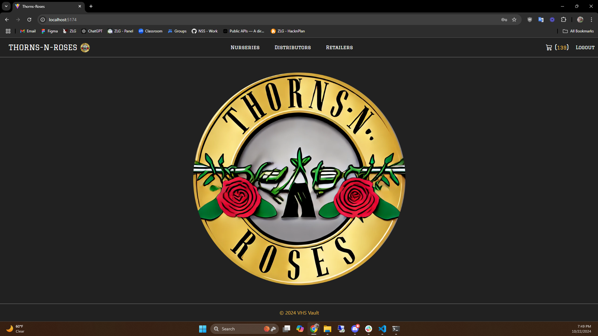
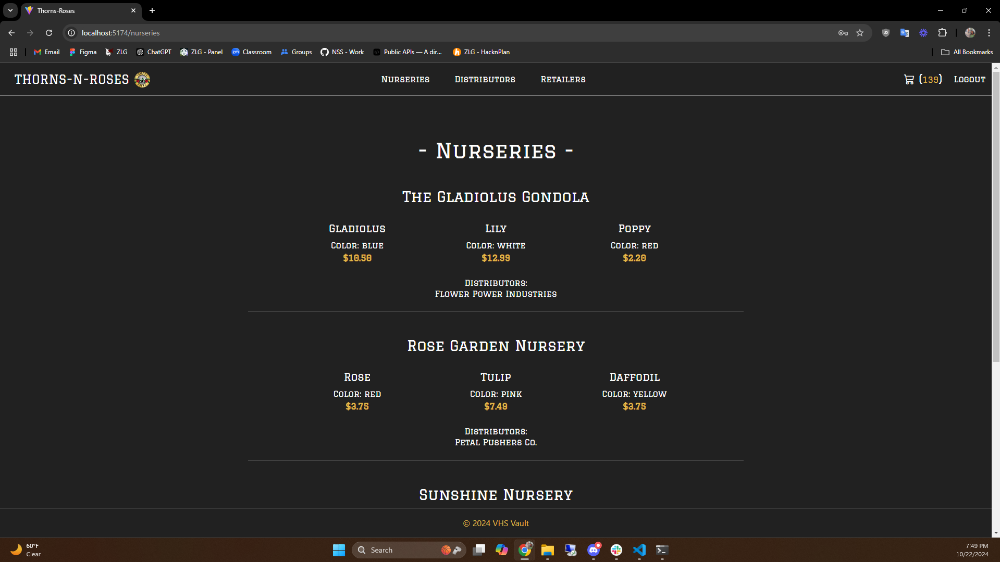
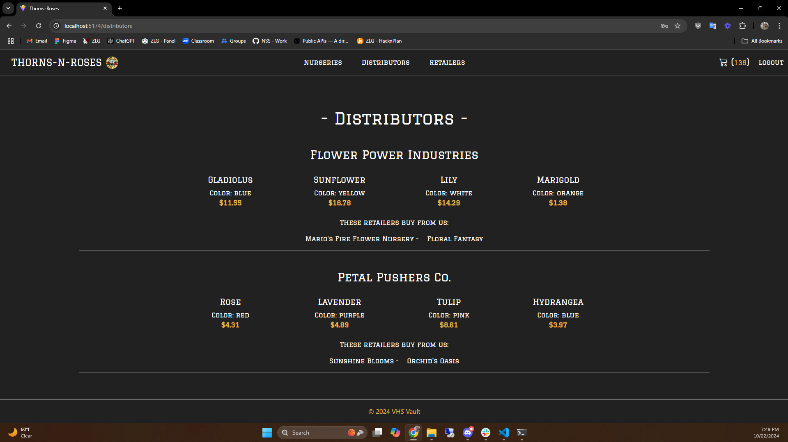
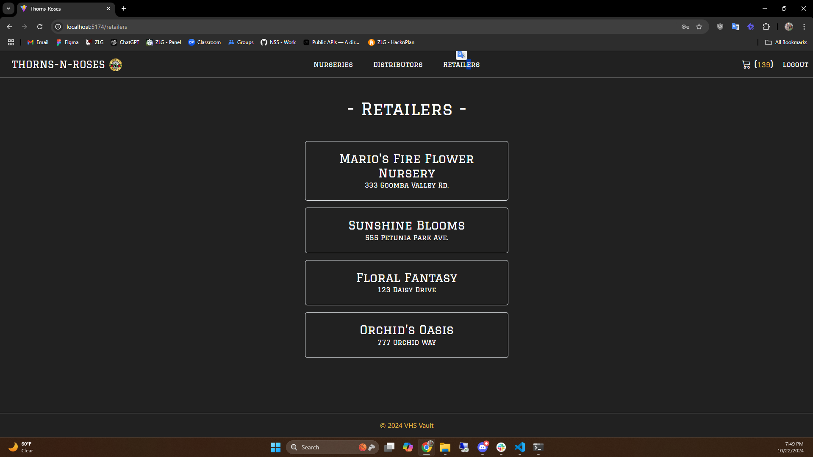
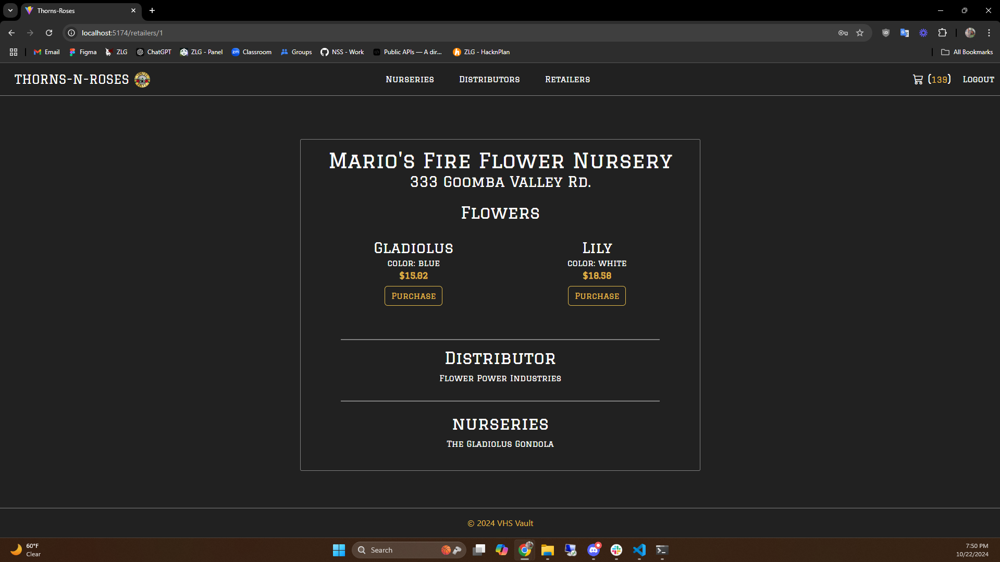
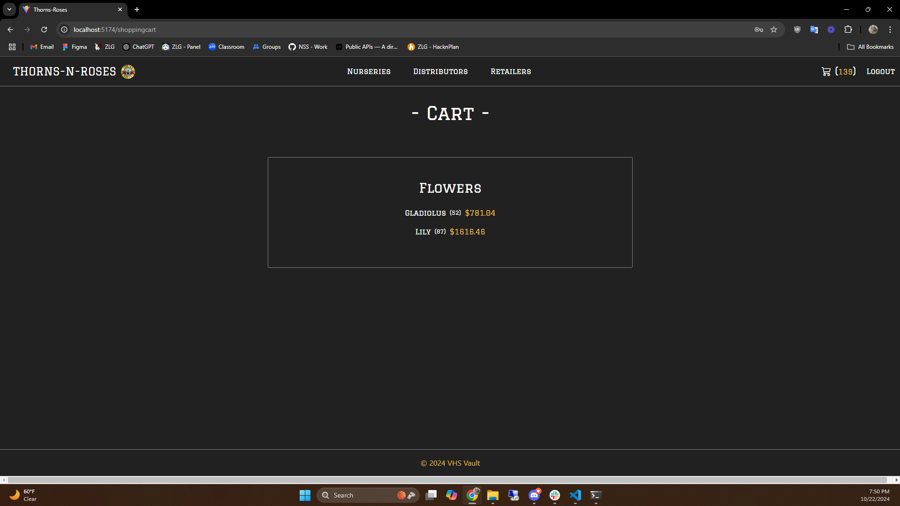

## Thorns N Roses

Thorns N Roses is a team-based project designed to allow users to view and purchase plants from various distributors. The app integrates several technologies to create a seamless experience for browsing, selecting, and buying plants across different sources.

## Features
* Product Viewing: Provides users with an intuitive UI to browse a wide selection of plants across different distributors. 
* Distributor Integration: Enables users to explore products from multiple distributors within a single platform. 
* Order Placement: Allows customers to easily purchase plants through the app's secure purchasing interface.

## Tools & Technologies
* React.js: Framework for building a dynamic and responsive user interface. 
* GitHub Projects: Used to manage the team’s progress with daily commits, issue tracking, and branching workflows. 
* Unit Testing: Ensured code quality and functionality with unit tests throughout the development process.

## Skills & Technologies
* React.js 
* JavaScript 
* Unit Testing 
* GitHub Projects 
* UI/UX Design

